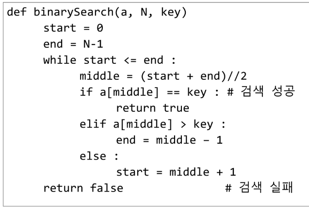
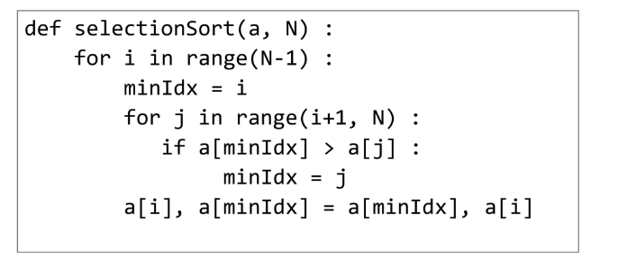

## 배열2

### 배열순회

- 행 우선 순회
  
  - n x m 배열의 모든 원소를 빠짐없이 조사하는 방법

```python
for i in range(n):
    for j in range(m):
        array[i][j]
```

- 열 우선 순회

```python
for j in range(m):
    for i in range(n):
        array[i][j]
```

### 델타를 이용한 2차 배열 탐색

- 2차 배열의 한 좌표에서 4방향의 인접 배열 요소를 탐색

```python
# 우하좌상 순임
di = [0, 1, 0, -1]
dj = [1, 0, -1, 0]

N = 2
M = 4

arr = [[1, 2, 3, 4], [4, 5, 6, 7]]


for i in range(N):
    for j in range(M):
        for k in range(4): # 이거는 상하좌우 4개니까
            ni = i + di[k]
            nj = j + di[k]
            if 0 <= ni < N and 0 <= nj < M: # 벽일수도 있으니
                print(arr[ni][nj])

        
```

### 부분집합

- 집합의 원소가 n개일때, 공집합을 포함한  부분집합의 수 = `2 ** n 개`

- 포함된 경우와 포함되지 않는 경우 2가지씩의 경우이기 때문

- for문을 계속 돌려서 부분집합을 생성할 수도 있지만 너무 복잡함

- **그래서 비트 연산자 이용**

- 부분집합 구할 때 수 많아지면 힘들어지니까 비트 연산자 나옴


### 검색

- 순차검색 - 말그대로임
  
  - 배열이나 연결 리스트 등 순차구조로 구현된 자료구조에서 원하는 항목을 찾을 때 유용함
  
  - 알고리즘이 단순하여 구현이 쉽지만, 검색 대상의 수가 많은 경우에는 수행시간이 급격히 증가하여 비효율적임

- 이진 검색 - 절반나눠서 검색
  
  - 자료의 가운데에 있는 항목의 키 값과 비교하여 다음 검색의 위치를 결정하고 검색을 계속 진행하는 방법
  
  - 목적 키를 찾을 때까지 이진 검색을 순환적으로 반복 수행함으로써 검색 범위를 반으로 줄여가면서 보다 빠르게 검색을 수행함
  
  - **이진 검색을 하기 위해서는 자료가 정렬된 상태여야 한다.**
  
  - 검색 범위의 시작점과 종료점을 이용하여 검색을 반복 수행한다.
  
  - 이진 검색의 경우, 자료에 삽입이나 삭제가 발생했을 때 배열의 상태를 항상 정렬 상태로 유지하는 추가 작업이 필요하다.



- 해쉬(hash)


### 선택 정렬(Selection Sort)

- 주어진 자료들 중 가장 작은 값의 원소부터 차례대로 선택하여 위치를 교환하는 방식

- 정렬 과정
  
  - 주어진 리스트 중에서 최소값을 찾는다.
  
  - 그 값을 리스트의 맨 앞에 위치한 값과 비교한다.
  
  - 맨 처음 위치를 제외한 나머지 리스트를 대상으로 위의 과정을 반복한다.




