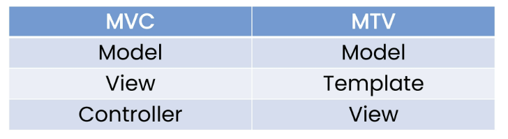
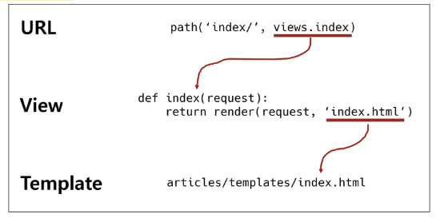

# :cloud:Django_0830

# :sparkles:목차

- [Django Intro](#Django-Intro)

- [Django 구조 이해하기(MTV Design Pattern)](#Django-구조-이해하기(MTV Design Pattern))

# :sparkles:Django Intro

### :sunny:Django 시작하기

- `프레임워크(Framework)` : 서비스 개발에 필요한 기능들을 미리 구현해서 모아 놓은 것

- 따라서, Framework 를 잘 사용하기만 하면 웹 서비스 개발에 있어서 모든 것들을 하나부터 열까지 직접 개발할 필요 없이, 내가 만들고자 하는 본질(로직)에 집중해 개발 가능

- 소프트웨어의 생산성과 품질을 높임

- 웹 서비스를 만들 수 있는 다양한 프레임워크 존재
  
  - Laravel, Django, Flask, Spring Boot, Express, Ruby on Rails, Meteor, Nest, Koa 등등

- Django 를 배워야 하는 이유
  
  - python 으로 작성된 프레임워크, python 이라는 언어의 강력함과 거대한 커뮤니티
  
  - 검증된 웹 프레임워크
    
    - 화해, Toss, 두나무, 당근마켓, 요기요 등
    
    - 유명한 많은 서비스들이 사용한다는 것 == 안정적으로 서비스를 할 수 있다는 검증

### :sunny:클라이언트와 서버

- 오늘날 우리가 사용하는 대부분의 웹 서비스는 클라이언트-서버 구조를 기반으로 동작

- 클라이언트
  
  - 웹 사용자의 인터넷에 연결된 장치(예를 들어 wi-fi 에 연결된 컴퓨터 또는 모바일)
  
  - chrome 또는 firefox 와 같은 웹 브라우저
  
  - 서비스를 요청하는 주체

- 서버
  
  - 웹 페이지, 사이트 또는 앱을 저장하는 컴퓨터
  
  - 클라이언트가 웹 페이지에 접근하려고 할 때 서버에서 클라이언트 컴퓨터로 웹 페이지 데이터를 응답해 사용자의 웹 브라우저에 표시됨
  
  - 요청에 대해 서비스를 응답하는 주체

- 어떠한 자원(source)를 달라고 요청(request)하는 쪽을 클라이언트라고 하고 자원을 제공해주는 쪽을 서버(server)라고 함

- 정리
  
  - 우리가 사용하는 웹은 클라이언트-서버 구조로 이루어져 있음
  
  - 앞으로 우리가 배우는 것도 이 클라이언트-서버 구졸르 만드는 방법을 배우는 것
  
  - 이 중에서 Django 는 서버를 구현하는 웹 프레임워크

### :sunny:web browser 와 web page

- 웹 브라우저란?
  
  - 웹에서 페이지를 찾아 보여주고, 사용자가 하이퍼링크를 통해 다른 페이지로 이동할 수 있도록 하는 프로그램
  
  - 웹 페이지 파일을 우리가 보는 화면으로 바꿔주는(렌더링, rendering) 프로그램

- 웹 페이지란?
  
  - 웹에 있는 문서
    
    - 우리가 보는 화면 각각 한 장 한 장이 웹 페이지
  
  - 웹 페이지 종류
    
    - 정적 웹 페이지
    
    - 동적 웹 페이지

# :sparkles:Django 구조 이해하기(MTV Design Pattern)

### :sunny:Design Pattern

- 소프트웨어 디자인 패턴
  
  - 소프트웨어도 수십년간 전 세계의 개발자들이 계쏙 만들다 보니 자주 사용되는 구조와 해결책이 있다는 것을 알게 됨
  
  - 앞서 배웠던 클라이언트-서버 구조도 소프트웨어 디자인 패턴 중 하나
  
  - 자주 사용되는 소프트웨어의 구조를 소수의 뛰어난 엔지니어가 마치 건축의 공법처럼 일반적인 구조화를 해둔 것

### :sunny:Django's Design Pattern

- Django 에서의 디자인 패턴
  
  - Django 에도 이러한 디자인 패턴이 적용이 되어 있는데, Django 에 적용된 디자인 패턴은 MTV 패턴이다.
  
  - MTV 패턴은 MVC 디자인 패턴을 기반으로 조금 변형된 패턴이다.
  
  - Django 는 MVC 패턴을 기반으로 한 MTV 패턴을 사용, 두 패턴은 서로 크게 다른 점은 없으며 일부 역함에 대해 부르는 이름이 다름
  
  - 

- MTV 디자인 패턴
  
  - Model
    
    - MVC 패턴에서 Model 의 역할에 해당
    
    - 데이터와 관련된 로직을 관리
    
    - 응용프로그램의 데이터 구조를 정의하고 데이터베이스의 기록을 관리
  
  - Template
    
    - 레이아웃과 화면을 처리
    
    - 화면상의 사용자 인터페이스 구조와 레이아웃을 정의
    
    - MVC 패턴에서 View 의 역할에 해당
  
  - View
    
    - Model & Template 과 관련한 로직을 처리해서 응답을 반환
    
    - 클라이언트의 요청에 대해 처리를 분기하는 역할
    
    - 동작예시
      
      - 데이터가 필요하다면 model 에 접근해서 데이터를 가져오고 가져온 데이터를 template 으로 보내 화면을 구성하고 구성된 화면을 응답으로 만들어 클라이언트에게 반환
    
    - MVC 패턴에서 Controller 의 역할에 해당

- 정리
  
  - Django 는 MTV 디자인 패턴을 가지고 있음
    
    - Model : 데이터 관련
    
    - Template : 화면 관련
    
    - View : Model & Template 중간 처리 및 응답 반환

# :sparkles:Django Quick start

### :sunny:기본설정

- 교재와 `프로젝트순서.txt` 참조해서 프로젝트 만들어보기 **p.54**

- 애플리케이션 주의사항-1
  
  - 반드시 생성 후 등록
  
  - INSTALLED_APPS 에 먼저 작성(등록)하고 생성라며면 앱이 생성되지 않음

### :sunny:요청과 응답

- URL - VIEW - TEMPLATE 순의 작성 순서로 코드를 작성해보고 데이터의 흐름을 이해하기

- 교재에 나와있는 순서대로 실습해보기 p.78

- render()
  
  - `render(request, template_name, context)`
  
  - 주어진 템플릿을 주어진 컨텍스트 데이터와 결합하고 렌더링 된 텍스트와 함께 HttpResponse(응답) 객체를 반환하는 함수
  
  - request
    
    - 응답을 생성하는 데 사용되는 요청 객체
  
  - template_name
    
    - 템플릿의 전체 이름 또는 템플릿 이름의 경로
  
  - context
    
    - 템플릿에서 사용할 데이터(딕셔너리 타입으로 작성)

- 코드 작성 순서
  
  - 앞으로 Django 에서의 코드 작성은 URL - View - Template 순으로 작성
  
  - "데이터의 흐름 순서"
  
  - 

# :sparkles:Django Template

### :sunny:Django Template

- 데이터 표현을 제어하는 도구이자 표현에 관련된 로직

- Django Template 을 이용한 HTML 정적 부분과 동적 컨텐츠 삽입

- Template System 의 기본 목표를 숙지

### :sunny:Django Template Language(DTL)

- Django template 에서 사용하는 built-in template system

- 조건, 반복, 변수 치환, 필터 등의 기능을 제공
  
  - python 처럼 일부 프로그래밍 구조(if, for 등)를 사용할 수 있지만 이것은 python 코드로 실행되는 것이 아님
  
  - Django 템플릿 시스템은 단순히 python 이 HTML 에 포함 된 것이 아니니 주의

### :sunny:DTL Syntax

- Variable, Filters, Tags, Comments

- `Variable`
  
  - `{{ variable }}`
  
  - render() 의 세번째 인자로 {'key': value} 와 같이 딕셔너리 형태로 넘겨주며, 여기서 정의한 key 에 해당하는 문자열이 template 에서 사용 가능한 변수명이 됨

- `Filters`
  
  - `{{ variale|filter }}`
  
  - 표시할 변수를 수정할 때 사용
  
  - 예시) name 변수를 모두 소문자로 출력 `{{ name|lower }}`
  
  - 60개의 built-in-template filters 를 제공
  
  - chained 가 가능하며 일부 필터는 인자를 받기도 함 `{{ name|truncatewords:30 }}`

- `Tags`
  
  - ``
  
  - 출력 텍스트를 만들거나, 반복 또는 논리를 수행하여 제어 흐름을 만드는 등 변수보다 복잡한 일들을 수행
  
  - 일부 태그는 시작과 종료 태그가 필요 ``
  
  - 약 24개의 built-in template tags 를 제공

- `Comments`
  
  - 한 줄 주석 : `{# #}`
  
  - 여러 줄 주석 : ``

- 교재의 실습 따라하기 **p.94**

### :sunny:Template inheritance

- 템플릿 상속
  
  - 템플릿 상속은 기본적으로 코드의 재사용성에 초점을 맞춤
  
  - 템플릿 상속을 사용하면 사이트의 모든 공통 요소를 포함하고, 하위 템플릿이 재정의(override) 할 수 있는 블록을 정의하는 기본 'skeleton' 템플릿을 만들 수 있음

- 템플릿 상속에 관련된 태그
  
  - ``
    
    - 자식(하위)템플릿이 부모 템플릿을 확장한다는 것을 알림
    
    - **반드시 템플릿 최상단에 작성되어야 함(즉, 2개 이상 사용할 수 없음)**
  
  - ``
    
    - 하위 템플릿에서 재지정(overridden)할 수 있는 블록을 정의
    
    - 즉, 하위 템플릿이 채울 수 있는 공간

- 상속 교재 따라서 실습해보기 **p.102**

- 추가 템플릿 경로 추가하기
  
  - base.html 의 위치를 앱 안의 template 디렉토리가 아닌 프로젝트 최상단의 templates 디렉토리 안에 위치하고 싶다면 어떻게 해야 할까? 교재에있음 p.104

# :sparkles:Sending and Retrieving form data

- "데이터를 보내고 가져오기"

- HTML form element 를 통해 사용자와 애플리케이션 간의 상호작용 이해하기

### :sunny:Sending form data(Client)

- HTML <form> element
  
  - 데이터가 전송되는 방법을 정의
  
  - 웹에서 사용자 정보를 입력하는 여러 방식(text, button, submit 등)을 제공하고, 사용자로부터 할당된 데이터를 서버로 전송하는 역할을 담당
  
  - "데이터를 어디(action)로 어떤 방식(method)으로 보낼지"
  
  - 핵심 속성
    
    - action
    
    - method

- HTML form's attributes
  
  - `action`
    
    - 입력 데이터가 전송될 URL 을 지정
    
    - 데이터를 어디로 보낼 것인지 지정하는 것이며 이 값은 반드시 유효한 URL 이어야 함
    
    - 만약 이 속성을 지정하지 않으면 데이터는 현재 form 이 있는 페이지의 URL 로 보내짐
  
  - `method`
    
    - 데이터를 어떻게 보낼 것인지 정의
    
    - 입력 데이터의 HTTP request methods 를 지정
    
    - HTML form 데이터는 오직 2가지 방법으로만 전송할 수 있는데 바로 GET 방식과 POST 방식

- `GET`
  
  - 서버로부터 정보를 조회하는 데 사용
    
    - 즉, 서버에게 리소스를 요청하기 위해 사용
  
  - 데이터를 가져올 때만 사용해야 함
  
  - 데이터를 서버로 전송할 때 Query String Parameters 를 통해 전송
    
    - 데이터는 URL 에 포함되어 서버로 보내짐

### :sunny:Retrieving the data(Server)

- 데이터 가져오기(검색하기)

- 서버는 클라이언트로 받은 key-value 쌍의 목록과 같은 데이터를 받게 됨

- 우리는 django 프레임워크에서 어떻게 데이터를 가져올 수 있을지 알아볼 것
  
  - throw 가 보낸 데이터를 catch 에서 가져오기

- 실습 따라하기. **p,126**

- 데이터 가져오기
  
  - 모든 요청 데이터는 view 함수의 첫번째 인자 `request` 에 들어있다.
  
  - request 가 어떤 객체인지 확인해보기


# :sparkles:Django URLs

```python
path('hello/<name>/', views.hello)
```

- 위에서 <name> 은 변수임. 정수일 때는 <int : number> 쓰면됨

- view 에서 받을 때 request 옆에 name 적어야함

- hello.html 에서 주소창에 일단 hello/철수 이런식으로 적어야함

### :sunny:App URL mapping

- 앱이 많아졌을 때 urls.py 를 각 app 에 매핑하는 방법을 이해하기

- 두번째 app 인 pages 를 생성 및 등록하고 진행

- app 의 view 함수가 많아지면서 사용하는 path() 또한 많아지고, app 또한 더 많이 작성되기 때문에 프로젝트의 urls.py 에서 모두 관리하는 것은 프로젝트 유지보수에 좋지 않음

- 하나의 프로젝트에 여러 앱이 존재한다면, 각각의 앱 안에 urls.py 을 만들고 프로젝트 urls.py 에서 각 앱의 urls.py  파일로 URL 매핑을 위탁할 수 있음

- 실습 따라하기 **p.150**

- **include 사용**
