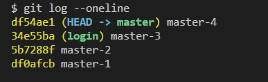
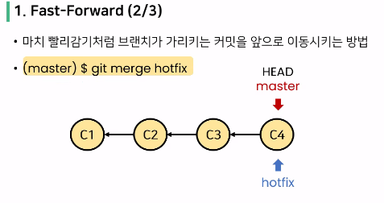
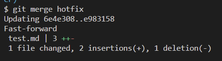
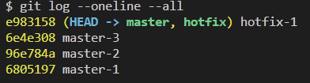
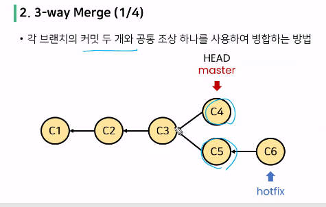
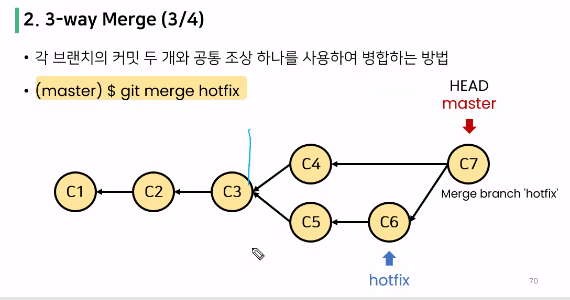
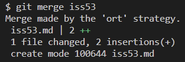
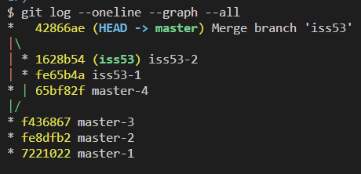
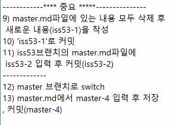

* cd ..

* mkdir asd 

* git init

* touch readme.md (touch가 파일생성 명령어인듯?)

* ls

* git status

* git add .

* git rm --cached readme.md

* git add .

* git commit -m '1st commit'

* git log --oneline 이거 뭐지? 커밋 상태 알려주는듯?? 깃발위치랑

* git log --oneline --all 모든 브랜치에서의 커밋목록조회가능

* git log --oneline --graph --all (좀더 자세히 그려진거 볼수있음)

# 깃 작업 되돌리기

* 워킹 디렉토리 -> 이전 커밋상태
  
  * git restore

* 스태이징 에이리어 -> 워킹 디렉토리
  
  * git rm --cached (루트 커밋 없으면)
  
  * git restore --staged + 파일이름 (루트 커밋 있으면)

* 커밋 완료 -> 스테이징 에이리어로 되돌리기
  
  * git commit --amend

커밋을 완료한 파일을 되돌리기

staging area 에 새로 올라온 내용이 없다면, 직전 커밋의 메시지만 수정

git commit --amend (완전히 새로운 커밋으로 바꿈)

i 누르면 끼워넣기 모드로 바뀜, 커멧메시지 고치기

esc 키 누르고 :(콜론)누르고 w(저장), q(종료)

git reset

시계를 마치 과거로 돌리는 듯한 행위로, 프로젝트를 특정 커밋(버전) 상태로 되돌림

특정 커밋으로 되돌아 갔을 때, **해당 커밋 이후로 쌓았던 커밋들은 전부 사라짐**

soft 옵션은 스테이징 에어리어로 감, 커밋전으로 감.다시 커밋 가능

mixed 옵션은 워킹디렉토리로 감. add 하기 전으로 감. unstage 상태로 가는거

hard 옵션은 파일을 워킹디렉토리에서 삭제해버림. 주의해서 사용하기.

git reflog 명령어를 이용하면 reset 하기전으로 가능

디폴트 옵션은 mixed 옵션

 

soft 부터 실습

first로 되돌리기

oneline 하고 git reset --soft 6baf32f 입력후 oneline

깃발 상황 보기

git status 해보기

 

mixed 실습

ls -a

git log --oneline

git reset --mixed 6baf32f

git status

 

hard 실습

위에랑 똑같이 하면 2.txt 랑 3.txt 는 없어짐

reflog 하면 살릴수있는 가능성 있음.

 

git revert

과거를 없었던 일로 만드는 행위로, `이전 커밋을 취소한다는 새로운 커밋을 생성함`

보통 협업할 때 reset 보다는 revert 로 함

revert 는 github 을 이용해 협업할 때, 커밋 내역의 차이로 인한 충돌 방지 가능

bash 창에 git revert ~  이런식으로 쓰기

 

git branch

생성할 때 보통 git branch {브랜치 이름} 이거씀

조회는 git branch

 

git switch

**switch 하기 전에, 해당 브랜치의 변경 사항을 반드시 커밋 해야함을 주의할 것!**

다른 브랜치에서 파일을 만들고 커밋하지 않은 상태에서 switch 를 하면 브랜치를 이동했음에도 불구하고 해당 파일이 그대로 남아있게 됨

 

HEAD

HEAD 는 현재 브랜치를 가리키고, 각 브랜치는 자신의 최신 커밋을 가리키므로 결국 HEAD 가 현재 브랜치의 최신 커밋을 가리킨다고 할 수 있음

`결국 git switch 는 현재 브랜치에서 다른 브랜치로 HEAD 를 이동시키는 명령어`

 

### 새로운 브랜치 만들기 실습

새로운 폴더 생성

git init

touch test.md

md 파일에 내용 적기

git add .

git commit -m 'master-1'

md 파일 내용수정

git add .

git commit -m 'master-2'

md 파일 내용수정

git add .

git commit -m 'master-3'

git log --oneline --graph --all (좀더 자세히 그려진거 볼수있음)

git branch login

git branch 로 조회

git switch login (login 으로 브랜치 옮기기)

git switch master (다시 master 로 옮기기)

여기서 md 내용 수정하고 add, commit 하고 oneline 해보면

master 가 위에 있음(`master branch 가 login branch 보다 commit 1개 앞서있음`)

git log --oneline --all 모든 브랜치에서의 커밋목록조회가능

 

git merge

분기된 브랜치들을 하나로 합치는 명령어

master 브랜치가 상용이므로 주로 master 브랜치에 병합(master 로 스위치해야함)

병합하기 전에 브랜치를 합치려고 하는, 즉 메인 브랜치로 스위치해야함

병합에는 세 종류가 존재

- fast_forward
  
  - hotfix 가 commit 앞서있는경우 마치 빨리감기처럼 브랜치가 가리키는 커밋을 앞으로 이동시키는 방법
  
  - (master)로 스위치 후  git merge hotfix
  
  - 이때, 커밋의 수가 늘어나지는 않음

병합이 완료된 브랜치는 삭제하는 게 관용!!

git branch -d hotfix 하면 hotfix 브랜치 지워짐

병합안한상태라 에러뜨면, git branch -D hotfix 하면 지워짐

 

- 3-way merge
  
  - 새로운 커밋을 만드는 방법(C7)
  
  - hotfix 에도 md 파일 만들어서 commit 하고, master 로 스위치해서 또 md 파일 커밋한 후 merge

- 결과

- merge 한 후 iss53 브랜치는 삭제하기 -d 이용

- git workflow

- branch 와 원격 저장소를 이용해 협업을 하는 두가지 방법
  
  - 원격 저장소 소유권이 있는 경우 - Shared repository model
    
    - `수업에서 집중할 부분`
    
    - 앞으로 이 방법으로 협업할 예정
  
  - 원격 저장소 소유권이 없는 경우 - Fork & Pull model
    
    - 원격 저장소를 바로 clone 을 못 해옴.. Fork 를 하고 clone 가능
