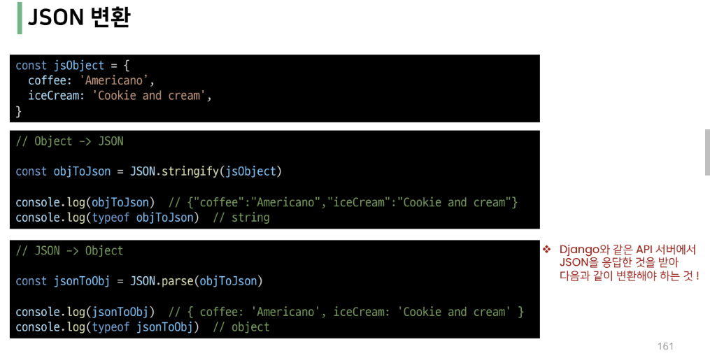

### 💗 자바스크립트 기초문법

- 주석
  
  - 한줄주석(//)
  
  - 여러 줄 주석(/* */)

<br>

- let
  
  - 재할당 가능 & 재선언 불가능

- const
  
  - 재할당 불가능 & 재선언 불가능
  
  - 선언시 반드시 초기값 설정해야함

<br>

- NaN 모르겠음,,,

- 줄바꿈하려면 `\n` 사용, 백틱으로 감싸도 줄바꿈 됨.

- 백틱사용하면 변수사용가능
  
  - 홍길동은 ${age}세 입니다. 백틱으로 감싸기

<br>

- 동등연산자(==) 와 일치연산자(===)
  
  - 동등연산자(==)
    
    - 두 피연산자가 같은 값으로 평가되는지 비교 후 불린값을 반환
    
    - 비교할 때 암묵적 타입 변환 통해 타입을 일치시킨 후 같은 값인지 비교
  
  - 일치연산자(===)
    
    - 두 피연산자의 값과 타입이 모두 같은 경우 true 를 반환
    
    - 암묵적 타입 변환이 발생하지 않음

- 삼항연산자
  
  - 가장 앞의 조건식이 참이면 :(콜론) 앞의 값이 반환, 아니면 뒤의 값이 반환

<br>

- 조건문 if, else if, else

```js
const name = '소희'

if (name === 'admin') {
    console.log('관리자님 환영합니다.')
} else if (name === 'manager') {
    console.log('매니저님 환영합니다.')
} else {
    console.log(`${name}님 환영합니다.`)
}
```

- switch
  
  - break 및 default 문은 선택적으로 사용 가능
  
  - break 문이 없는 경우 break 문을 만나거나 default 문을 실행할 때까지 다음 조건문 실행

```js
const name = '홍길동'

switch(name) {
  case '관리자': {
    console.log('관리자님 환영')
    break
  }
  case '홍길동': {
    console.log('매니저 하이')
    break
  }
  default: {
    console.log(`${name}님 환영함...`)
  }
}
```

- if / switch
  
  - 조건이 많은 경우 switch 문을 통해 가독성 향상을 기대할 수 있음

<br>

- while
  
  - 조건문이 참이기만 하면 문장을 계속해서 수행

```js
let i = 0

while (i < 6) {
  console.log(i)
  i += 1
}
```

<br>

- for
  
  - 특정한 조건이 거짓으로 판별될 때까지 반복

```js
for (let i = 0; i < 6; i++) {
  console.log(i)
} 
// 0, 1, 2, 3, 4, 5
```

<br>

- for...in
  
  - 객체의 속성을 순회할 때 사용

```js
const fruits = { a: 'apple', b: 'banana' }

for (const key in fruits) {
  console.log(key)
  console.log(fruits[key])
}
```

<br>

- for...of
  
  - 반복 가능한 객체를 순회할 때 사용
  
  - 반복 가능한 객체의 종류: array, set, string

```js
const numbers = [0, 1, 2, 3]

for (const number of numbers) {
  console.log(number)
}
```

<br>

- for...in 과 for...of 의 차이
  
  - for...in 은 "속성 이름"을 통해 반복
  
  - for...of 는 "속성 값"을 통해 반복

```js
const arr = [3, 5, 7]

for (const i in arr) {
  console.log(i) // 0 1 2
}

for (const i of arr) {
  console.log(i) // 3 5 7
}
```

<br>

### 💗 함수

- 함수 선언식

```js
function add(num1, num2) {
  return num1 + num2
}

console.log(add(1, 2))
```

- 함수 표현식
  
  - 표현식 내에서 함수를 정의하는 방식
  
  - 함수 표현식은 함수의 이름을 생략한 익명 함수로 정의 가능
  
  - 표현식에서 함수 이름을 명시하는 것도 가능
  
  - 다만 이 경우 함수 이름은 호출에 사용되지 못하고 디버깅 용도로 사용됨

```js
const sub = function (num1, num2) {
  return num1 - num2
}

console.log(sub(7, 2))
```

- 함수 표현식
  
  - 인자 작성 시 '=' 문자 뒤 기본 인자 선언 가능

```js
const greeting = function (name = 'anonymous') {
  console.log(`${name}님 방가방가`)
}

greeting()
```

<br>

- Spread syntax
  
  - 배열복사

```js
const parts = ['a', 'b']
const lyrics = ['ag', 'ad', ...parts]

console.log(lyrics) // ['ag', 'ad', 'a', 'b']
```

- Spread syntax
  
  - 함수와의 사용(Rest parameters)
  
  - 정해지지 않은 수의 매개변수를 배열로 받을 수 있음

```js
const restOpr = function (arg1, arg2, ...restArgs) {
  return [arg1, arg2, restArgs]
}

console.log(restOpr(1, 2, 3, 4, 5)) // [1, 2, [3, 4, 5]]
```

- 호이스팅 - 선언식
  
  - 함수 선언식으로 정의한 함수는 var 로 정의한 변수처럼 호이스팅이 발생
  
  - 즉, 함수 호출 이후에 선언해도 동작, 함수표현식은 안그럼... 그래서 권장함

```js
console.log(add(2, 7)) // 9

function add (num1, num2) {
  return num1 + num2
}
```

- **화살표 함수**
  
  - 함수를 비교적 간결하게 정의할 수 있는 문법
  
  - function 키워드와 중괄호를 이용한 구문을 짧게 사용하기 위해 탄생
    
    - function 키워드 생략가능
    
    - 함수의 매개변수가 하나 뿐이라면 매개변수의 '()' 생략 가능 - 비생략 권장
    
    - 함수의 내용이 한 줄이라면 '{}' 와 'return' 도 생략 가능

```js
const arrw1 = function (name) {
  console.log(`hello, ${name}`)
}

const arrow1 = (name) => `hello, ${name}`


console.log(arrow1('소희'))
```

<br>

- JSON
  
  - JavaScript 의 Object 와 유사한 구조를 가지고 있지만 Object 는 그 자체로 타입이고, JSON 은 형식이 있는 "문자열"
  
  - 즉, JSON 을 Object 로 사용하기 위해서는 변환 작업이 필요


