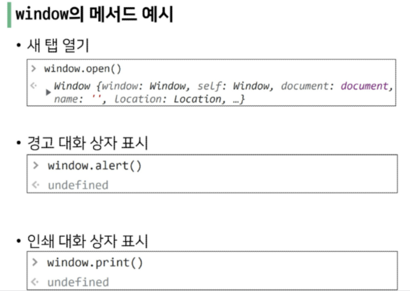
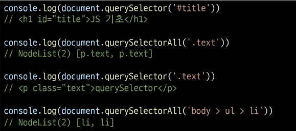
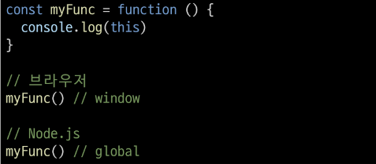
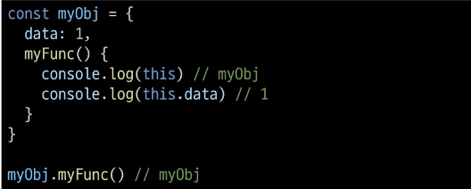
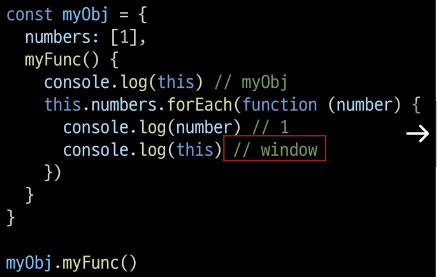
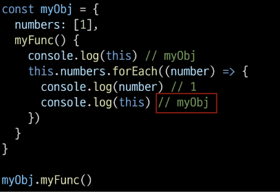

## 💘 1024 자바스크립트

-- 중간에 내용 비어있음. 시간 날 때 채우기! 근데 시간이 날까? 시간이 나도 채울까?

 

#### 💗 DOM

- 개요
  
  - 브라우저에서의 자바스크립트
  
  - 자바스크립트는 웬페이지에서 다양한 기능을 구현하는 스트립트 언어

- DOM
  
  - 문서객체모델(document object model)
  
  - DOM 은 문서를 논리 트리로 표현
  
  - DOM 메서드를 사용하면 프로그래밍적으로 트리에 접근할 수 있고 이를 통해 문서의 구조, 스타일, 컨텐츠를 변경할 수 있음
  
  - DOM 은 웹 페이지의 객체 지향 표현이며, js 와 같은 스크립트 언어를 이용해 DOM 을 수정할 수 있음
  
  - 우리는 "DOM 의 주요 객체"들을 활용하여 문서를 조작하거나 특정 요소들을 얻을 수 있음

- DOM 의 주요 객체
  
  - window
    
    - DOM 을 표현하는 창
    
    - 가장 최상위 객체(작성 시 생략 가능)
    
    - 탭 기능이 있는 브라우저에서는 각각의 탭을 각각의 window 객체로 나타냄
    
    - 구글홈피에서 console 창 열고 다음과 같이 입력해보기
    
     
    
    
    
     
  
  - document
    
    - 브라우저가 불러온 웹 페이지
    
    - 페이지 컨텐프의 진입점 역할을 하며, <body> 등과 같으나 수많은 다른 요소들을 포함하고 있음
  
  - navigator, location, history, screen 등

- DOM 조작
  
  - document 가 제공하는 기능을 사용해 웹 페이지 문서 조작하기
  
  - DOM 조작 순서
    
    - `선택 -> 조작(생성, 추가, 삭제 등)`
  
  - **선택 관련 메서드**
    
    - document.querySelector(selector)
      
      - 제공한 선택자와 일치하는 element 한 개 선택
      
      - 제공한 CSS selector 를 만족하는 첫 번째 element 객체를 반환
    
    - document.querySelectorAll(selector)
      
      - 제공한 선택자와 일치하는 여러 element를 선택
      
      - 매칭할 하나 이상의 셀렉터를 포함하는 유요한 CSS selector 를 인자로 받음
      
      - 제공한 CSS selector 를 만족하는 NodeList 를 반환
      
       
      
      
      
      ✔경로찾기가 어려운데 검사 - elements 에서 찾으려 하는 거 누르고, 마우스 오른쪽, copy - selector 선택하면 경로 복사됨.
      
      ✔id 는 # 으로, class 는 . 으로 !!
      
       
  
  - 조작 관련 메서드
    
    - document.createElement(tagName)
      
      - 작성한 tagName 의 HTML 요소를 생성하여 반환
      
      - p태그 같은거 만들 수 있다는 뜻

 

#### 💗 this

- this
  
  - 어떠한 object 를 가리키는 키워드
  
  - javascript 의 함수는 호출될 때 this 를 암묵적으로 전달받음
  
  - javascript 의 this 는 일반적은 프로그래밍 언어에서의 this 와 조금 다르게 동작
  
  - js 는 `해당 함수 호출 방식`에 따라 this 에 바인딩 되는 객체가 달라짐
  
  - 즉, 함수를 선언할 때 this 에 객체가 결정되는 것이 아니고, 함수를 호출할 때 함수가 `어떻게 호출 되었는지`에 따라 동적으로 결정
    
    - 전역 문맥에서의 this
      
      - 브라우저의 전역 객체인 window 를 가리킴
    
    - 단순 호출
    
    - Method(객체의 메서드로서)
    
    - Nested(콜백함수)

- 함수 문맥에서의 this
  
  - 단순호출
    
    - 전역객체를 가리킴
    
    - 전역은 브라우저에서는 window, Node.js 는 global 을 의미함
    
    
  
  - Method (객체의 메서드로서)
    
    - 메서드로 선언하고 호출한다면, 객체의 메서드이므로 해당 객체가 바인딩
    
    
    
     
  
  - Nested (Function 키워드)
    
    - forEach 의 콜백 함수에서의 this 가 메서드의 객체를 가리키지 못하고 전역 객체 window 를 가리킴
    
    - **단순 호출 방식으로 사용되었기 때문**
    
    - `이를 해결하기 위해 등장한 함수 표현식이 바로 "화살표 함수"`
    
    
  
  - Nested (화살표 함수)
    
    - 이전에 일반 function 키워드와 달리 메서드의 객체를 잘 가리킴
    
    - 화살표 함수에서 this 는 자신을 감싼 정적 범위
    
    - 자동으로 `한 단계 상위`의 scope 의 context 를 바인딩
    
    
  
  - this 와 addEventListener
    
    - 하지만.....
    
    - addEventListener 에서의 콜백 함수는 특별하게 function 키워드의 경우 addEventListener 를 호출한 대상 (event.target) 뜻함
    
    - 반면 화살표 함수의 경우 상위 스코프를 지칭하기 때문에 window 객체가 바인딩됨
    
    - 결론
      
      - "addEventListener 의 콜백 함수는 function 키워드를 사용하기"

