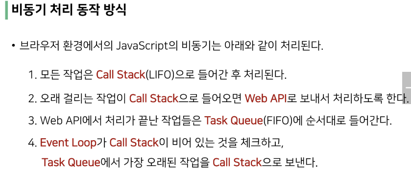

# 221026 js

 

#### 💗 동기와 비동기

- 동기
  
  - 모든 일을 순서대로 하나씩 처리하는 것
  
  - 이전 작업이 끝나야 다음 작업 시작 가능
  
  - 파이썬 코드가 동기식
  
  - 요청과 응답을 동기식으로 처리한다면, 요청을 보내면 응답이 올때까지 기다렸다가 다음 로직을 처리

- 비동기
  
  - 작업을 시작한 후 결과를 기다리지 않고 다음 작업을 처리하는 것 (병렬적 수행)
  
  - 예시) Gmail 에서 메일 전송을 누르면 목록 화면으로 전환되지만 실제로 메일을 보내는 작업은 병렬적으로 뒤에서 처리됨

- 비동기를 사용하는 이유
  
  - 사용자 경험
    
    - 비동기로 처리한다면 먼저 처리되는 부분부터 보여줄 수 있어서 사용자 경험에 긍정적

 

#### 💗 js 의 비동기 처리

- Single Thread 언어, JavaScript
  
  - js 는 한 번에 하나의 일만 수행할 수 있는 single thread 언어로 동시에 여러 작업을 처리할 수 없음. 그러면 어떻게 가능한거지?
  
  - 특정 언어가 동작할 수 있는 환경을 "런타임"이라 함
  
  - js 에서 비동기와 관련한 작업은 브라우저 또는 Node 환경에서 처리
  
  - 이중에서 브라우저 환경에서의 비동기 동작은 크게 아래의 요소들로 구성됨
    
    - JavaScript Engine 의 Call Stack
    
    - Web API
    
    - Task Queue
    
    - Event Loop

- 비동기 처리 동작 방식
  
  
  
   
  
  

- 정리
  
  - js 는 한 번에 하나의 작업을 수행하는 Single Thread 언어로 동기적 처리를 하지만, 브라우저 환경에서는 Web API 에서 처리된 작업이 지속적으로 Task Queue 를 거쳐 Event Loop 에 의해 Call Stack 에 들어와 순차적으로 실행됨으로써 비동기 작업이 가능한 환경이 된다.

#### 💗 Axios

- Axois
  
  - js 의 HTTP 웹 통신을 위한 라이브러리
  
  - 확장 가능한 인터페이스와 쉽게 사용할 수 있는 비동기 통신 기능을 제공

- Axios 사용
  
  - get, post 등 여러 method 사용가능
  
  - then 을 이용해서 성공하면 수행할 로직을 작성
  
  - catch 를 이용해서 실패하면 수행할 로직을 작성

- 정리
  
  - axios 는 비동기로 데이터 통신을 가능하게 하는 라이브러리
  
  - 같은 방식으로 우리가 배운 Django REST API 로 요청을 보내서 데이터를 받아온 후 처리할 수 있음

 

#### 💗 Callback 과 Promise

- 비동기 처리의 단점
  
  - 작업이 완료되는 순서에 따라 처리
  
  - 실행 결과를 예상하면서 코드를 작성할 수 없게 함
  
  - 어떻게 해야할까? `콜백함수를 사용하자`

- 콜백 함수
  
  - 특별한 함수x, 다른 함수의 인자로 전달되는 함수
  
  - 비동기에만 사용되는 함수가 아니며 동기, 비동기 상관없이 사용 가능
  
  - 시간이 걸리는 비동기 작업이 완료된 후 실행할 작업을 명시하는 데 사용되는 콜백함수를 **비동기 콜백**이라 부름

- 콜백 함수 사용 이유
  
  - 명시적 호출이 아닌 특정한 조건 혹은 행동에 의해 호출되도록 작성
  
  - "요청이 들어오면", "이벤트가 발생하면" 등의 조건으로 이후 로직을 제어 가능
  
  - 비동기 처리를 순차적으로 동작할 수 있게 함

 

- 프로미스
  
  - 콜백지옥 문제를 해결하기 위해 등장한 비동기 처리를 위한 객체
  
  - "작업이 끝나면 실행 시켜줄게"라는 약속(promise)
  
  - 비동기 작업의 완료 또는 실패를 나타내는 객체
  
  - promise 기반의 클라이언트가 바로 이전에 사용한 axios 라이브러리!
  
  - 성공에 대한 약속 then()
  
  - 실패에 대한 약속 catch()
