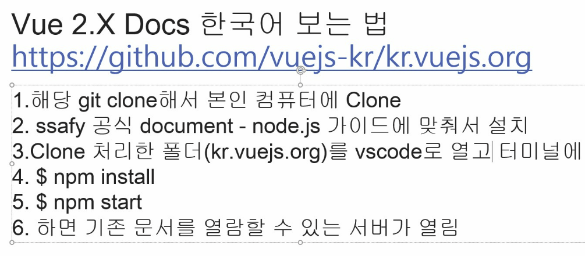
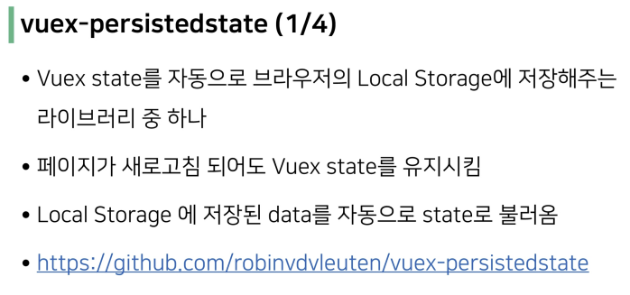
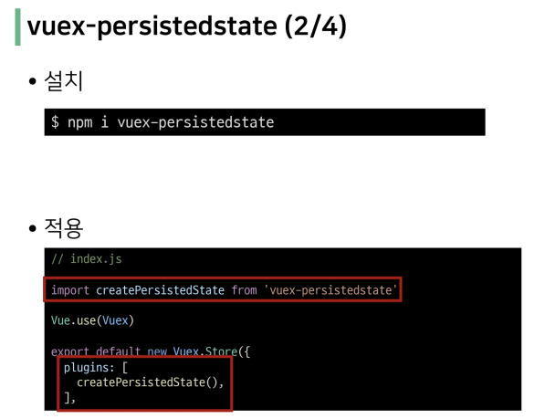

# ✔vue

#### 💗 프론트엔드

- Vue.js
  
  - JavaScript Front-end Framework

- SPA (Single Page Application)
  
  - 이전까지는 사용자의 요청에 적절한 페이지 별 template 을 반환
  
  - SPA 는 서버에서 최초 1장의 HTML 만 전달받아 모든 요청에 대응하는 방식을 의미
  
  - CSR (Client Side Rendering) 방식으로 요청을 처리하기 때문

- SSR (Server Side Rendering)
  
  - 기존의 요청 처리 방식은 SSR
  
  - Server 가 사용자의 요청에 적합한 HTML 을 렌더링하여 제공하는 방식
  
  - 전달받은 새 문서를 보여주기 위해 브라우저는 새로고침을 진행

- CSR (Client Side Rendering)
  
  - 최초 한 장의 HTML 을 받아오는 것은 동일. 단, server 로부터 최초로 받아오는 문서는 빈 html 문서
  
  - 각 요청에 대한 대응을 JavaScript 를 사용하여 필요한 부분만 다시 렌더링
  
  - 매번 새 문서를 받아 새로고침하는 것이 아니라 필요한 부분만 고쳐 나가므로 각 요청이 끊김없이 진행

 

#### 💗 MVVM Pattern

- MVVM Pattern
  
  - 소프트웨어 아키텍처 패턴의 일종
  
  - M - Model, V - View, VM - ViewModel
  
  - View - 우리 눈에 보이는 부분 = DOM
  
  - Model - 실제 데이터 = JSON
  
  - View Model
    
    - View 를 위한 Model
    
    - View 와 연결되어 Action 을 주고 받음
  
  - View 는 Model 을 몰라요, Model 도 View 를 몰라요

 

#### 💗 vuex-persistedstate

